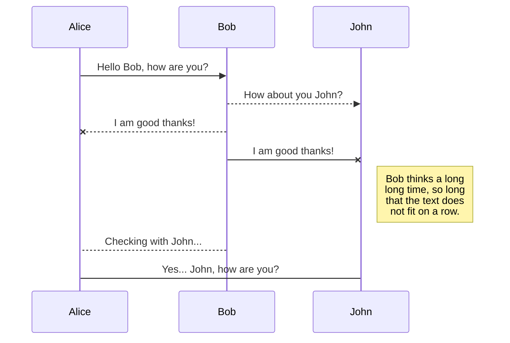
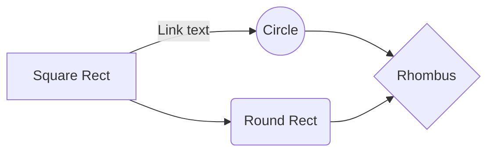

# MyanmarMapping
ETL function to run on Azure Functions to automate data ingestion and transformation to feed a conflict map

# Myanmar Conflict Mapping Azure Function

This repo houses an Azure function that automatically collects data from the Armed Conflict Location & Event Database  (ACLED) for Myanmar and stores it in a SQL database. This code base is in flux as there will be an ACLED python package for internal use that will genericize large portions of the api calls. However, it is fully functional and resources that rely on the connected SQL database should not expect changes to the data structure. 

# Getting Started

The easiest way to deploy an Azure web function is to use the VSCode IDE and download the Azure Functions extension. The extension can be found at the following  [link].(https://marketplace.visualstudio.com/items?itemName=ms-azuretools.vscode-azurefunctions)

Blah, Blah, Blah (Full direction will be written when the code base is genericized for use with multiple countries. 

## Data Schema

The function requires that a SQL database already exist to which data can be written. In most instances this will be an Azure SQL instance. 
Ultimately, the will be three tables written to the database, an *acledEvents* table that includes the conflict events, an *actors* table that includes the unique values for actors in the ACLED dataset, and an *actorMap* table that is an adjacency list representing the initiator and target of each conflict event as the edge in a graph. 

(Leaving the following example markdown content to remind myself how to create flowcharts) 
## UML diagrams

You can render UML diagrams using [Mermaid](https://mermaidjs.github.io/). For example, this will produce a sequence diagram:

And this will produce a flow chart:

